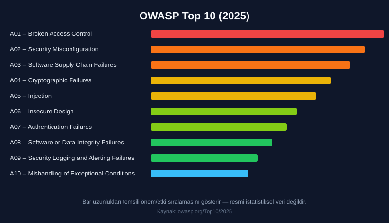
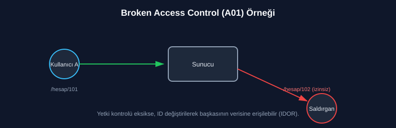
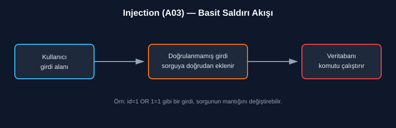

# OWASP Top 10:2025 — Web Uygulamalarındaki En Kritik 10 Güvenlik Riski

Web uygulamaları günümüzde neredeyse her sektörün omurgasını oluşturuyor — bankacılıktan e-ticarete, sağlıktan eğitime kadar. Bu kadar yaygın kullanım, aynı zamanda saldırganlar için de geniş bir hedef kitlesi anlamına geliyor. **OWASP Top 10**, Open Web Application Security Project (OWASP) tarafından düzenli aralıklarla yayımlanan ve web uygulamalarında en sık karşılaşılan, en yüksek riskli güvenlik açıklarını sıralayan bir referans listesidir.

2021'den sonraki ilk büyük güncelleme olan **2025 sürümü**, 175.000'den fazla CVE kaydı ve yüzlerce CWE üzerinden yapılan analizle hazırlandı; iki yeni kategori eklendi ve sıralama önemli ölçüde değişti. Bu yazıda güncel 10 kategoriye teknik açıdan kısa bir bakış atacağız.

## 1. A01 – Broken Access Control (Bozuk Erişim Kontrolü)

2021'de olduğu gibi listenin zirvesinde. Bir kullanıcının, yetkisi olmayan kaynaklara veya işlemlere erişebilmesi durumudur. En klasik örneği **IDOR/BOLA** (Insecure Direct Object / Broken Object Level Authorization): bir isteğin içindeki `id=101` parametresini `id=102` olarak değiştirdiğinizde sunucu yetki kontrolü yapmadan başkasının verisini döndürüyorsa açık buradadır. 2025 sürümünde bu kategori, eskiden ayrı bir madde olan **SSRF**'yi (Server-Side Request Forgery) de kapsıyor.

**Önlem:** Her istekte sunucu tarafında rol/yetki doğrulaması yapmak, "varsayılan olarak reddet" (deny by default) prensibini uygulamak.

## 2. A02 – Security Misconfiguration (Güvenlik Yanlış Yapılandırması)

2021'de 5. sıradaydı, 2025'te 2. sıraya yükseldi — test edilen uygulamaların neredeyse tamamında bir tür yanlış yapılandırma bulunuyor. Varsayılan parolaların değiştirilmemesi, gereksiz servislerin açık bırakılması, ayrıntılı hata mesajlarının (stack trace) kullanıcıya gösterilmesi gibi durumları kapsar.

**Önlem:** Sertleştirme (hardening) rehberlerinin uygulanması, otomatik yapılandırma denetimi, üretim ortamında debug modunun kapalı olması.

## 3. A03 – Software Supply Chain Failures (Yazılım Tedarik Zinciri Hataları)

2025'te yeni eklenen, topluluk anketinde en çok #1 oy alan kategori. Eskiden "bilinen açıklara sahip bileşen kullanımı" olarak dar tanımlanan risk, artık tüm tedarik zincirini kapsayacak şekilde genişledi: güncellenmeyen bağımlılıklar, güvenilmeyen kaynaklardan alınan paketler, zayıf CI/CD güvenliği. 2025'teki npm ekosistemini hedef alan kendiliğinden yayılan `Shai-Hulud` solucanı, bu kategoriye örnek bir gerçek dünya olayı.

**Önlem:** SBOM (Software Bill of Materials) tutmak, bağımlılıkları ve transitive paketleri sürekli izlemek, imzalı/güvenilir kaynaklardan paket almak, CI/CD güvenliğini sertleştirmek.

## 4. A04 – Cryptographic Failures (Kriptografik Hatalar)

Hassas verilerin (şifreler, kredi kartı bilgileri, kimlik verileri) zayıf algoritmalarla şifrelenmesi, hiç şifrelenmemesi ya da iletim sırasında düz metin (HTTP) üzerinden taşınmasıdır. MD5 veya SHA-1 gibi kırılmış özet fonksiyonlarıyla parola saklamak bu kategoriye girer.

**Önlem:** TLS zorunlu kılınmalı, parolalar bcrypt/argon2 gibi tuzlu (salted) ve yavaş algoritmalarla saklanmalıdır.

## 5. A05 – Injection (Enjeksiyon)

2021'de 3. sıradaydı, 2025'te 5. sıraya geriledi — ama hâlâ kritik. Kullanıcıdan alınan verinin doğrulanmadan bir yorumlayıcıya (SQL, komut satırı, LDAP vb.) gönderilmesiyle oluşur. SQL Injection en bilinen türüdür, ancak Command Injection ve NoSQL Injection da bu ailededir.

**Önlem:** Parametreli sorgular (prepared statements), ORM kullanımı, girdi doğrulama ve en az yetki prensibi.

## 6. A06 – Insecure Design (Güvensiz Tasarım)

Bir kodlama hatasından çok, **tasarım aşamasında** güvenliğin hiç düşünülmemiş olmasıyla ilgilidir. Örneğin şifre sıfırlama akışında rate-limiting olmaması, iş mantığında (business logic) istismar edilebilir boşluklar bırakılması gibi.

**Önlem:** Tehdit modelleme (threat modeling), güvenli tasarım desenlerinin erken aşamada mimariye dahil edilmesi.

## 7. A07 – Authentication Failures (Kimlik Doğrulama Hataları)

Zayıf parola politikaları, oturum yönetimindeki eksiklikler, brute-force saldırılarına karşı önlem alınmaması bu başlık altında toplanır.

**Önlem:** Çok faktörlü kimlik doğrulama (MFA), güvenli oturum yönetimi, hesap kilitleme/rate-limit mekanizmaları.

## 8. A08 – Software or Data Integrity Failures (Yazılım veya Veri Bütünlüğü Hataları)

Kod veya altyapının, bütünlüğü doğrulanmadan güvenilmeyen kaynaklardan alınmasıdır. Güvensiz CI/CD pipeline'ları veya imzasız yazılım güncellemeleri buna örnektir.

**Önlem:** Dijital imza doğrulama, güvenilir paket kaynakları, CI/CD güvenliğinin denetlenmesi.

## 9. A09 – Security Logging and Alerting Failures (Günlükleme ve Uyarı Eksiklikleri)

Bir saldırı gerçekleştiğinde bunu tespit edecek yeterli loglama ve uyarı altyapısının olmamasıdır. Bu durum, saldırganların sistemde uzun süre fark edilmeden kalmasına yol açar.

**Önlem:** Merkezi log yönetimi (SIEM), anormal davranış uyarıları, düzenli log incelemesi.

## 10. A10 – Mishandling of Exceptional Conditions (Olağandışı Durumların Yanlış Ele Alınması)

2025'te yeni eklenen bir diğer kategori. Uygulamanın beklenmedik durumları (hata, eksik parametre, kaynak tükenmesi vb.) öngörmemesi, tespit edememesi veya doğru şekilde ele alamamasıdır. Örneğin, bir işlem yarıda kesildiğinde geri alınmaması (fail closed yerine fail open davranışı) ciddi güvenlik açıklarına yol açabilir.

**Önlem:** Her hatayı oluştuğu yerde yakalamak, işlemleri tamamlanmadıysa geri almak (rollback), merkezi hata yönetimi ve loglama, kaynak/oran sınırlama (rate limiting, quotas) uygulamak.

---

## Sonuç

OWASP Top 10:2025, bir "tam güvenlik kontrol listesi" değil; en sık ve en etkili risklere dikkat çeken bir **öncelik haritası**dır. 2021 sürümüne göre öne çıkan en önemli değişiklik, sıralamanın artık daha çok **kök nedenlere** (misconfiguration, supply chain, exceptional conditions gibi sistemik sorunlara) odaklanması. Bir geliştirici ya da güvenlik araştırmacısı olarak bu listeyi anlamak, hem savunma tarafında (secure coding) hem de saldırı tarafında (pentest, CTF) sağlam bir temel oluşturur. PortSwigger Web Security Academy gibi platformlar, bu kategorilerin çoğu için ücretsiz, uygulamalı laboratuvarlar sunduğundan konuyu pekiştirmek için iyi bir sonraki adımdır.

*Kaynak: [owasp.org/Top10/2025](https://owasp.org/Top10/2025/)*
