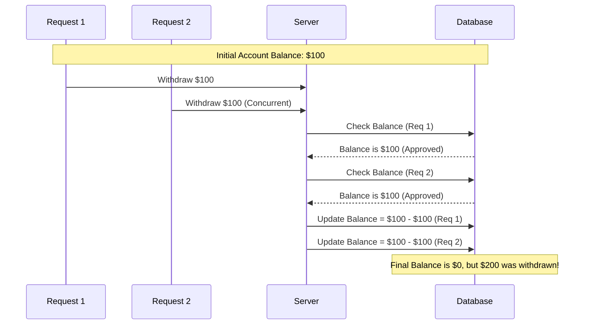
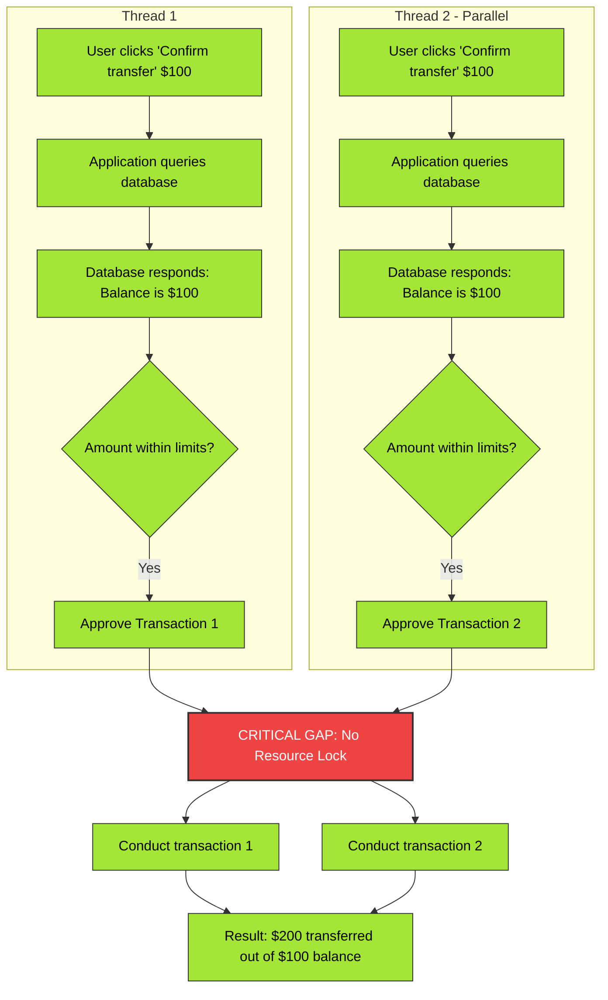

# Understanding Vulnerable Python Code

*How seemingly functional implementations can quietly introduce serious security vulnerabilities.*

---

## Table of Contents

1. [Prerequisites](#1-prerequisites)
2. [Five Vulnerable Code Patterns](#2-five-vulnerable-code-patterns)
   - [2.1 IDOR / BOLA — Order Cancellation](#21-idor--bola--order-cancellation)
   - [2.2 SQL Injection — Search Filter](#22-sql-injection--search-filter)
   - [2.3 SSRF — Webhook / URL Preview Fetcher](#23-ssrf--webhook--url-preview-fetcher)
   - [2.4 Insecure Deserialization — Session Restore](#24-insecure-deserialization--session-restore)
   - [2.5 Path Traversal — File Download](#25-path-traversal--file-download)
3. [Race Conditions in Web Applications](#3-race-conditions-in-web-applications)
   - [3.1 Why They Happen: Hidden States in Business Logic](#31-why-they-happen-hidden-states-in-business-logic)
   - [3.2 Exploiting the Window](#32-exploiting-the-window)
   - [3.3 Detection](#33-detection)
   - [3.4 Mitigation](#34-mitigation)
4. [Summary](#4-summary)

---

## 1. Prerequisites

To get the most out of this post, it helps to be familiar with:

- Python fundamentals
- Basic Node.js concepts
- Cross-Site Scripting (XSS)
- Insecure Direct Object References (IDOR)
- SQL Injection
- Race Conditions

---

## 2. Five Vulnerable Code Patterns

Each example below looks like ordinary, functional code — none of it raises obvious red flags on a quick read, and all of it passes a basic "does it work" test. That's exactly why these patterns are dangerous: authorization, sanitization, and trust-boundary checks are easy to omit when the focus is on shipping a feature rather than defending it.

### 2.1 IDOR / BOLA — Order Cancellation

**Stack:** Node.js / Express

```javascript
app.post('/api/orders/:orderId/cancel', requireAuth, async (req, res) => {
  const order = await Order.findById(req.params.orderId);
  order.status = 'cancelled';
  await order.save();
  res.json({ success: true });
});
```

**Vulnerability:** The route requires authentication (`requireAuth`), but never checks that the order actually belongs to the requesting user. Any logged-in user can cancel **any** order simply by guessing or incrementing `orderId` — a classic Insecure Direct Object Reference (IDOR), also known as Broken Object Level Authorization (BOLA).

**Fix:**
```javascript
if (order.userId !== req.user.id) {
  return res.status(403).json({ error: 'Forbidden' });
}
```

---

### 2.2 SQL Injection — Search Filter

**Stack:** Python / Flask

```python
@app.route("/api/products")
def search_products():
    category = request.args.get("category")
    query = f"SELECT * FROM products WHERE category = '{category}'"
    result = db.execute(query)
    return jsonify(result.fetchall())
```

**Vulnerability:** User input is interpolated directly into the SQL string. A request like `category=' OR '1'='1` returns the entire table — or worse, enables data exfiltration or destructive queries depending on DB permissions.

**Fix:**
```python
query = "SELECT * FROM products WHERE category = ?"
result = db.execute(query, (category,))
```

---

### 2.3 SSRF — Webhook / URL Preview Fetcher

**Stack:** Node.js

```javascript
app.post('/api/preview-url', requireAuth, async (req, res) => {
  const { url } = req.body;
  const response = await axios.get(url);
  res.json({ content: response.data });
});
```

**Vulnerability:** The server fetches whatever URL the client supplies, with no scheme, domain, or IP restrictions. An attacker can point `url` at internal infrastructure — for example `http://169.254.169.254/latest/meta-data/` to reach a cloud provider's instance metadata service, or any other internal-only service the server can reach but the attacker can't.

**Fix:** Restrict to `https://` only, resolve the hostname and reject private/link-local/loopback IP ranges, and ideally enforce a domain allowlist.

---

### 2.4 Insecure Deserialization — Session Restore

**Stack:** Python

```python
@app.route("/api/session/restore", methods=["POST"])
def restore_session():
    data = request.data
    session_obj = pickle.loads(data)
    return jsonify(session_obj.to_dict())
```

**Vulnerability:** `pickle.loads()` executes arbitrary Python code embedded in the deserialized payload via crafted `__reduce__` methods. Any client that can POST to this endpoint can achieve remote code execution.

**Fix:** Never deserialize untrusted data with `pickle`. Use `json.loads()` with a strict, validated schema instead — JSON cannot carry executable objects.

---

### 2.5 Path Traversal — File Download

**Stack:** Node.js / Express

```javascript
app.get('/api/files/:filename', requireAuth, (req, res) => {
  const filePath = path.join(__dirname, 'uploads', req.params.filename);
  res.sendFile(filePath);
});
```

**Vulnerability:** `path.join` doesn't stop traversal sequences from escaping the intended directory. A request for `filename=../../etc/passwd` (or its URL-encoded form `..%2f..%2f`) can read arbitrary files on the filesystem that the process has access to.

**Fix:**
```javascript
const resolvedPath = path.resolve(__dirname, 'uploads', req.params.filename);
const baseDir = path.resolve(__dirname, 'uploads');
if (!resolvedPath.startsWith(baseDir)) {
  return res.status(400).json({ error: 'Invalid filename' });
}
res.sendFile(resolvedPath);
```

---

## 3. Race Conditions in Web Applications


### 3.1 Why They Happen: Hidden States in Business Logic

Every meaningful action in a web app — approving a transfer, redeeming a coupon, casting a vote — isn't really a single instant. It's a sequence of steps:

1. The client sends a request.
2. The server checks a condition against the database.
3. The database responds.
4. The server commits the change.

Each of these steps takes real (if tiny) time.

If you sketch this as a state diagram, what looks like a simple two-state flow (`not applied` → `applied`) almost always hides intermediate states once you look closer — things like `checking eligibility`, `validating constraints`, `recalculating totals`. Between the moment a check *passes* and the moment the result is actually *persisted*, there's a window where the system has decided to allow the action but hasn't yet recorded that it happened.

> **That gap is the whole vulnerability.**

If nothing locks the resource during that window, the same check can pass multiple times in parallel before any of the writes land. This is a **race condition** — specifically a **Time-Of-Check-To-Time-Of-Use (TOCTOU)** issue.


**Common examples:**

| Feature | The check | The exploitable gap |
|---|---|---|
| Coupon redemption | "Is this coupon still valid?" | Coupon can be applied multiple times before it's marked used |
| Money transfer | "Does the account have sufficient balance?" | Balance can be debited past zero via concurrent transfers |
| Voting / rate limiting | "Has this user already voted/acted?" | Vote or action can be repeated before the "already done" flag is set |

---

### 3.2 Exploiting the Window

The catch is that this window is usually very short — often milliseconds. Exploiting it reliably means getting multiple requests to hit the server **nearly simultaneously**, not just quickly one after another.

Tools like **Burp Suite Repeater** are built for exactly this: grouping several copies of the same request and firing them either in sequence or in true parallel.

- **Sequential requests** (even fast ones) tend to get caught correctly — there's enough of a gap for the first write to land before the second check runs.
- **Parallel requests** are what actually cause the collision — many requests arrive close enough together that they all read the same "before" state and all get approved, before any of them writes back the "after" state.

**In practice:** duplicating a single valid request 20+ times and firing them in parallel against a feature like a phone-credit transfer can result in *all* of them succeeding — even when the account balance should only have covered one.

The sequence below shows exactly how this plays out for a $100 withdrawal race, where both concurrent requests pass the balance check before either one writes back the new balance:



Both requests read the same starting balance before either commits — so both get approved, and the second write silently overwrites the first instead of stacking on top of it. The account ends at $0, but $200 left the building.

The flowchart below lays the same race out as two parallel threads converging on the same unlocked resource:



Both threads pass their own independent balance check, and neither one knows about the other — the "CRITICAL GAP" node is exactly the unlocked window described above. Whether it's framed as a sequence diagram or a flowchart, the underlying failure is the same: two reads of the same stale state, with no lock between them.

---

### 3.3 Detection

Race conditions are easy to miss from a business or ops perspective. If a handful of users manage to redeem the same gift card twice, or a vote gets counted an extra time, it often just looks like noise. Nothing breaks loudly, and unless someone is specifically auditing logs for duplicate state transitions, it goes unnoticed. That's part of what makes this class of bug dangerous — it doesn't announce itself, and it can compound with other, subtler logic flaws.

This is largely a **find-it-yourself problem**: race conditions surface through deliberate testing (penetration testers, bug bounty researchers) rather than through normal monitoring.

**General approach:**

1. **Understand normal behavior** — what limits are enforced? (one-time use, once-per-vote, rate limits, balance checks, cooldowns like "once every 5 minutes," etc.)
2. **Map the state transitions** — where might a time window exist between a check and its corresponding write?
3. **Attempt to violate the limit** by firing concurrent requests through that window.

---

### 3.4 Mitigation

Three standard techniques close this gap:

**Synchronization (Locks)**
Ensure only one thread or process can act on a given shared resource at a time. Competing requests queue up instead of running the check-then-write sequence concurrently.

**Atomic Operations**
Structure the check-and-update as a single indivisible operation rather than two separate steps, so there's no window in which another request can slip in between them.

**Database Transactions**
Wrap the relevant read and write in a transaction so the whole sequence either commits together or fails as a group — preventing two concurrent processes from both modifying the same record based on stale data.

---

## 4. Summary

Whether it's a missing ownership check, an unsanitized query, an unrestricted outbound fetch, an unsafe deserializer, an unvalidated file path, or a "check, then act" pattern with no lock around it — the pattern across all of these is the same: **the code works fine under normal use, and fails silently under adversarial use.**

That's the real lesson for anyone reviewing AI-generated or fast-shipped "vibe coded" backends: functionality passing a manual test tells you almost nothing about whether the trust boundaries are actually enforced. Closing that gap requires deliberately testing for it — ownership checks, input sanitization, safe deserialization, path resolution, and concurrency control — not just confirming the happy path works.
