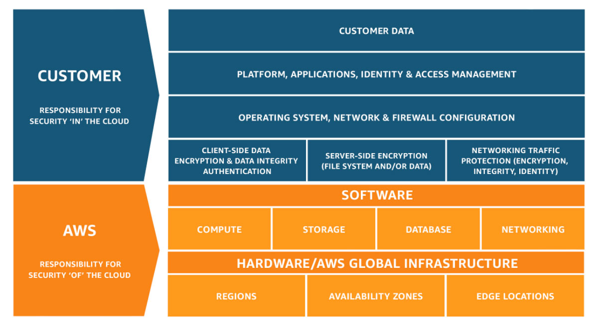
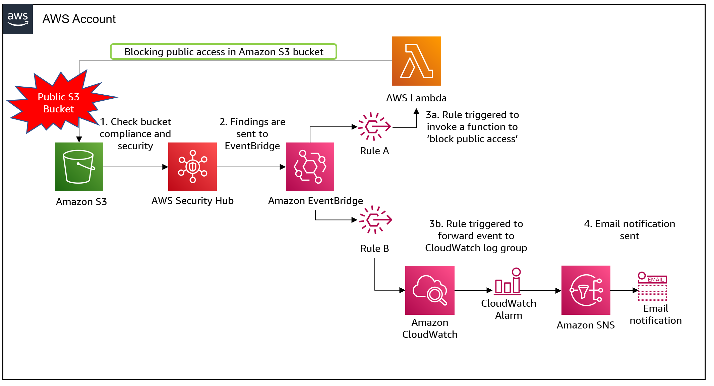
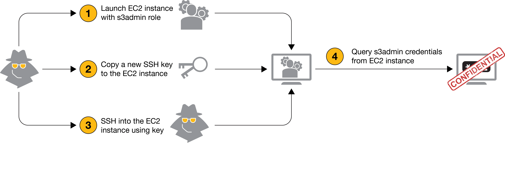

# Bulut Bilişim Güvenliği: Yapılandırma Hataları ve Güvenli AWS Mimarisi
Bulut teknolojilerine geçiş yapan kurumsal yapıların düştüğü en büyük stratejik hata, güvenliği bir "BT problemi" olarak görüp bulut sağlayıcısının (AWS, Azure, GCP) her şeyi otomatik olarak koruyacağını varsaymaktır. Bu yaklaşım, yanlış yapılandırmaların gözden kaçmasına ve doğrudan güvenlik risklerine yol açabilir. Oysa modern bulut güvenliği, sorumluluğun keskin hatlarla ayrıldığı bir doktrin üzerine kuruludur. AWS tarafından tanımlanan Ortak Sorumluluk Modeli (Shared Responsibility Model), bu güvenliğin iki temel direği olduğunu söyler:
* **Bulutun Güvenliği (Security OF the Cloud):** Fiziksel altyapı, veri merkezleri ve hipervizör katmanının güvenliğinden sağlayıcı sorumludur.
* **Bulutun İçindeki Güvenlik (Security IN the Cloud):** Veri, IAM, ağ yapılandırması ve şifreleme gibi alanlardaki sorumluluk; kullanılan AWS servisine ve müşterinin yaptığı yapılandırmalara göre değişir.

Bulut ortamlarındaki güvenlik olaylarının önemli bir bölümü; yanlış yapılandırmalar, aşırı yetkiler ve kimlik bilgilerinin kötü yönetimi gibi müşteri tarafındaki hatalarla ilişkilidir. Bu nedenle bulut güvenliği yalnızca teknik bir konu değil, aynı zamanda finansal ve operasyonel sonuçları olan bir risk yönetimi konusudur.

> **Stratejik Görünürlük Notu:** Altyapı görünürlüğü, güvenliğin alfabesidir. Envanterini çıkaramadığınız, trafiğini izleyemediğiniz ve yapılandırmasını kodla denetleyemediğiniz bir kaynağı koruyamazsınız. Görmediğiniz ve izlemediğiniz bir kaynağı güvenli şekilde yönetmek zordur.

Güvenliğin teorik çerçevesinden, en sık yapılan ve "basit" görünen pratik hatalara geçiş yapıyoruz.

---

## 2. Başlangıç Seviyesi İçin "Bulut Kazaları" ve Analojiler

Bulut dünyasında en büyük felaketler genellikle karmaşık sıfırıncı gün saldırılarından değil, unutulan küçük bir ayardan kaynaklanır. Teknik olmayan profesyonellerin bile anlaması gereken dört temel risk alanını analiz edelim:

### S3 Kovaları: Yanlışlıkla Açık Bırakılan Depo
* **Hata:** S3 (Simple Storage Service) gibi depolama alanlarının "Public" bırakılması.
* **Analoji:** S3 bucket'ını herkese açık bırakmak, şirketin hassas belgelerini içeren bir dolabı sokağa koyup herkesin erişimine izin vermeye benzer.
* **PRO TIP:** S3 "Block Public Access" ayarını hesap düzeyinde aktif edin. Bu, yanlışlıkla bile olsa bir kovanın internete açılmasını engelleyen bir emniyet kilididir.

### MFA and Root Hesap: Anahtarın Konumu
* **Hata:** Root hesabın (en yetkili hesap) MFA ile korunmaması.
* **Analoji:** MFA kullanmamak, evinizin kapısını kilitleyip anahtarı paspasın altına koymaktır.
* **PRO TIP:** Root hesabını günlük işler için kullanmayın. MFA'yı etkinleştirin ve mümkünse donanım tabanlı MFA kullanın. Root hesabının erişim bilgilerini yalnızca gerekli durumlarda kullanın.

### Aşırı Yetkili IAM: Her Kapıyı Açan Maymuncuk
* **Hata:** Kullanıcılara veya servislere "AdministratorAccess" gibi gereksiz genişlikte yetkiler verilmesi.
* **Analoji:** Bir stajyere sadece fotokopi odasının anahtarını vermeniz gerekirken, binadaki tüm kapıları, kasaları ve server odasını açan tek bir master anahtar vermeye benzer.
* **PRO TIP:** "Least Privilege" (En Az Yetki) ilkesini uygulayın. Sadece işin yapılması için gereken minimum yetkiyi tanımlayın.

### İnternete Açık Güvenlik Grupları (Security Groups)
Yönetim portlarının tüm internete (`0.0.0.0/0`) açık olması, saldırganlar için açık bir davetiyedir.

| Port | Servis | Risk | Modern Güvenli Yaklaşım |
| :--- | :--- | :--- | :--- |
| **22** | SSH | Brute-force saldırıları. | AWS Systems Manager Session Manager kullanın. |
| **3389** | RDP | Uzaktan tam erişim riski. | Sadece VPC Endpoints veya VPN IP'sine izin verin. |
| **3306/5432** | DB | Yetkisiz veritabanı erişimi, brute-force ve servis istismarı. | İnternete kapatın, yalnızca gerekli uygulama katmanına izin verin. |

Temel hataları giderdikten sonra, veri katmanının kalbi olan RDS yapılandırmalarındaki derin teknik detaylara iniyoruz.

---

## 3. İleri Düzey El Defteri: Kritik AWS RDS Yapılandırma Kontrolleri

İlişkisel veritabanı servisi (RDS), verilerinizin kalesidir. Ancak bu kaleyi yanlış inşa etmek, siber felaketlerin ana kaynağıdır. İşte en kritik 15 RDS hatası:

1. **Kamusal Erişilebilir RDS Örnekleri**
   * *Risk:* `PubliclyAccessible` bayrağı aktifse veritabanınız internetten doğrudan brute-force saldırısına uğrayabilir.
   * *Tespit:* `aws rds describe-db-instances --query "DBInstances[?PubliclyAccessible==\`true\`].{ID:DBInstanceIdentifier}"`
   * *Remediation:* Bayrağı false yapın ve RDS'i sadece private subnet'lerde barındırın.

2. **Kamusal Veritabanı Snapshot'ları**
   * *Risk:* Snapshot 'public' yapılırsa dünyadaki her AWS hesabı verinizi kopyalayabilir.
   * *Tespit:* `aws rds describe-db-snapshots --snapshot-type manual --include-public`
   * *Remediation:* Snapshot özniteliklerinden 'all' değerini kaldırın.

3. **Encryption at Rest Kapalı**
   * *Risk:* Disk üzerindeki verinin şifrelenmemesi, fiziksel veya mantıksal sızıntılarda verinin okunmasına neden olur.
   * *Tespit:* `aws rds describe-db-instances --query "DBInstances[?StorageEncrypted==\`false\`].{ID:DBInstanceIdentifier}"`
   * *Remediation:* Yeni örneklerde mutlaka şifrelemeyi aktif edin (mevcutlarda şifreli snapshot üzerinden taşıma gerekir).

4. **AWS-Managed Keys Kullanımı**
   * *Risk:* Varsayılan anahtarlar (`aws/rds`) üzerinde kontrolünüz (rotasyon, politika) kısıtlıdır.
   * *Remediation:* Customer-Managed Keys (CMK) kullanarak anahtar yönetimini elinize alın.

5. **SSL/TLS Zorunluluğunun Olmaması**
   * *Risk:* Veritabanı trafiğinin ağ üzerinde "cleartext" izlenmesi.
   * *Tespit:* RDS Parametre grubunda `rds.force_ssl` (PostgreSQL) veya `require_secure_transport` (MySQL) kontrolü.
   * *Remediation:* Bu parametreleri 1 olarak set ederek şifreli bağlantıyı zorunlu kılın.

6. **IAM Database Authentication Devre Dışı**
   * *Risk:* Statik şifrelerin çalınma riski.
   * *Remediation:* IAM rolleriyle geçici token bazlı erişimi aktif edin (`--enable-iam-database-authentication`).

7. **Master Kimlik Bilgilerinin Secrets Manager'da Olmaması**
   * *Risk:* Master şifrenin kod içinde veya manuel yönetilmesi.
   * *Remediation:* Şifre yönetimini AWS Secrets Manager'a devredin ve otomatik rotasyonu açın.

8. **Yetersiz Yedekleme (Backup) Süresi**
   * *Risk:* Ransomware veya yanlışlıkla silme durumlarında geri dönememe.
   * *Remediation:* Retention period'u en az 7 gün (ideal 14-30) olarak ayarlayın.

9. **Deletion Protection (Silme Koruması) Kapalı**
   * *Risk:* Tek bir hata veya saldırganın `DeleteDBInstance` komutuyla verinin tamamen yok olması.
   * *Remediation:* `--deletion-protection` bayrağını aktif edin.

10. **Kontrolsüz Security Group (`0.0.0.0/0`)**
    * *Risk:* Veritabanı portunun tüm dünyaya açık olması.
    * *Remediation:* Sadece uygulama sunucularının Security Group ID'lerine izin verin.

11. **Log Export'un Devre Dışı Olması**
    * *Risk:* Olay anında adli analizin imkansızlaşması.
    * *Remediation:* Audit, error, slowquery loglarını CloudWatch Logs'a gönderin.

12. **Multi-AZ Yapılandırmasının Olmaması**
    * *Risk:* Bölgesel kesintilerde (outage) tam veri kaybı ve iş durması.
    * *Remediation:* Kritik veritabanlarında Multi-AZ kullanarak yüksek kullanılabilirlik sağlayın. Bölgesel felaketlere karşı ayrıca cross-region yedekleme ve felaket kurtarma planı oluşturun.

13. **Auto Minor Version Upgrade Kapalı**
    * *Risk:* Güvenlik yamalarının alınmaması ve CVE açıklarına maruz kalma.
    * *Remediation:* `--auto-minor-version-upgrade` özelliğini aktif edin.

14. **RDS'in İnternet Erişimli Subnetlerde Gereksiz Konumlandırılması**
    * *Risk:* Erişim kapalı olsa bile internet gateway rotası olan bir ağda bulunmak savunma derinliğini azaltır.
    * *Remediation:* RDS örneklerini Route Table'ında IGW olmayan izole subnet'lere taşıyın.

15. **Event Notifications Yapılandırması Eksikliği**
    * *Risk:* Bir failover veya saldırı girişimi anında haberdar olamama.
    * *Remediation:* Kritik RDS olaylarını (security, failover, failure) SNS üzerinden uyarılara bağlayın.

---

## 4. İleri Güvenlik Analizi: IAM Yetki Yükseltme (Privilege Escalation)

IAM yetki yükseltme, kısıtlı yetkilere sahip bir saldırganın "sıçrama tahtası" kullanarak tam yönetici (Administrator) yetkisine ulaştığı karmaşık bir zincirdir.

### Yetki Yükseltme Zinciri Analizi
* **CreatePolicyVersion:** Kullanıcı, kendi sahip olduğu bir politikaya yeni bir versiyon ekleyip `set-as-default` bayrağıyla kendini sınırsız yetkili yapabilir.
* **PassRole + RunInstances:** Saldırgan, admin yetkili bir IAM rolünü (role-splitting) yeni bir EC2'ya atar, o EC2'ya sızar ve metadata servisinden admin token'ını çalar.
* **Lambda Invoke:** Mevcut bir Lambda fonksiyonunun kodunu güncelleyerek (`UpdateFunctionCode`) kendisine admin yetkisi veren bir kod parçasını çalıştırabilir.

> **UYARI: KMS Hata Kalıpları** 
> KMS güvenliğinde **Pending Deletion Window** önemli bir kontrol noktasıdır. Bir KMS anahtarı silinmek üzere planlandığında AWS, yapılandırmaya bağlı olarak 7–30 günlük bir bekleme süresi uygular. Anahtar kalıcı olarak silindiğinde, o anahtara bağımlı şifreli verilerin kurtarılması mümkün olmayabilir. CloudTrail üzerinden KMS API çağrılarını izlemek de önemlidir; başarısız `kms:Decrypt` çağrıları tek başına saldırı kanıtı değildir ancak incelenmesi gereken önemli bir güvenlik sinyalidir. 
> *Unutmayın:* Key Policy dış kapıdır, IAM Policy iç kapıdır; her ikisi de onay vermeden veri çözülemez.

---

## 5. Ağ Güvenliği ve Modern Bulut Paradigması

Geleneksel veri merkezi yaklaşımındaki tek bir güvenlik sınırına dayalı model, bulut ortamlarında tek başına yeterli değildir. Bulutta ağ artık yazılımdır ve savunma dinamik olmalıdır.

### Eski Nesil Yaklaşım vs. Bulut Yerlisi Yaklaşım
* **Eski:** "Veri merkezi kafasını" buluta taşıyıp outbound (çıkış) trafiğini tamamen serbest (`0.0.0.0/0`) bırakmak.
* **Bulut Yerlisi:** Egress Filtering ile çıkış trafiğini sınırlandırmak, VPC Flow Logs ile ağ trafiğini görünür hale getirmek ve gerekli servis erişimlerinde VPC Endpoints/PrivateLink gibi özel bağlantıları kullanmak.

> **PRO TIP:** Veri sızdırma riskini azaltmak için çıkış trafiğini yalnızca gerekli hedeflerle sınırlandırın. İhtiyaca göre AWS Network Firewall, DNS Firewall veya VPC Endpoints/PrivateLink kullanılabilir. Kritik veritabanlarını private subnet'lerde tutmak saldırı yüzeyini azaltır.

---

## 6. Remediation ve Otomasyon Yol Haritası

Güvenlik bir "proje" değil, sürekli bir "yaşam döngüsüdür". Bu karmaşıklık ancak otomasyonla yönetilebilir.

### Güvenlik Otomasyonu Olgunluk Modeli
1. **Görünürlük:** Tüm kaynakların CSPM ile anlık envanterinin çıkarılması.
2. **Statik Tarama (Shift-Left):** Kodun canlıya çıkmadan IaC tarayıcılarından geçmesi.
3. **Graph-Based Analysis:** Varlıklar arasındaki ilişkileri analiz ederek gizli saldırı yollarını bulmak.
4. **Auto-Remediation:** Hatalı bir ayar algılandığında sistemin bunu otomatik geri çekmesi.

### IaC ve Güvenlik Otomasyon Araçları

| Araç Adı | Odak Noktası | Faydası |
| :--- | :--- | :--- |
| **Checkov / tfsec** | IaC (Terraform, K8s) | Kod yazılırken `0.0.0.0/0` gibi kuralları engeller. |
| **AWS Security Hub** | Uyumluluk Denetimi | CIS Benchmarks uyumunu anlık raporlar. |
| **Wiz / Cloudanix** | CSPM / Graph Analysis | Saldırı yollarını (Attack Paths) görselleştirir ve risk önceliklendirir. |

**Sonuç:** Bulut güvenliği statik bir liste değil; sürekli denetim, otomasyon ve iyileştirme döngüsüdür. Altyapınızı kodla (IaC) yönetin, güvenliği bu kodun içine gömün ve manuel hataları sistemin kendisiyle engelleyin.

