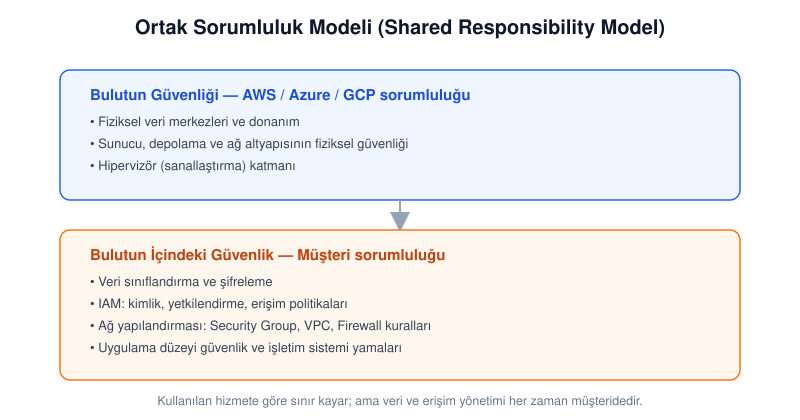
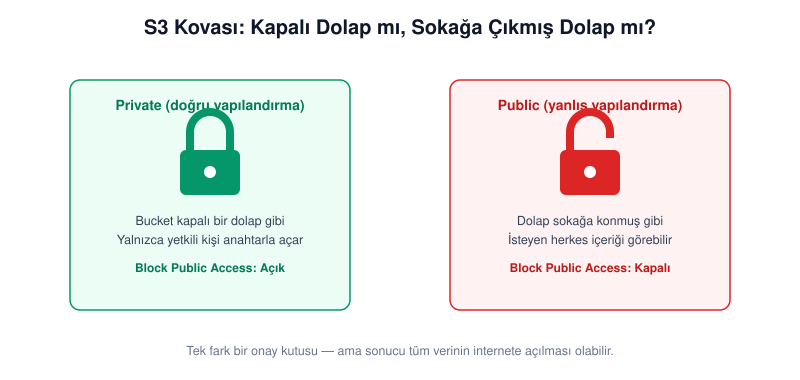
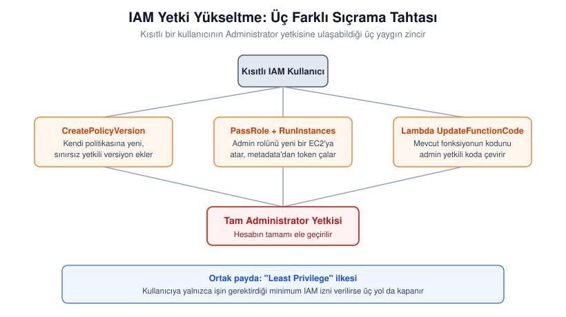
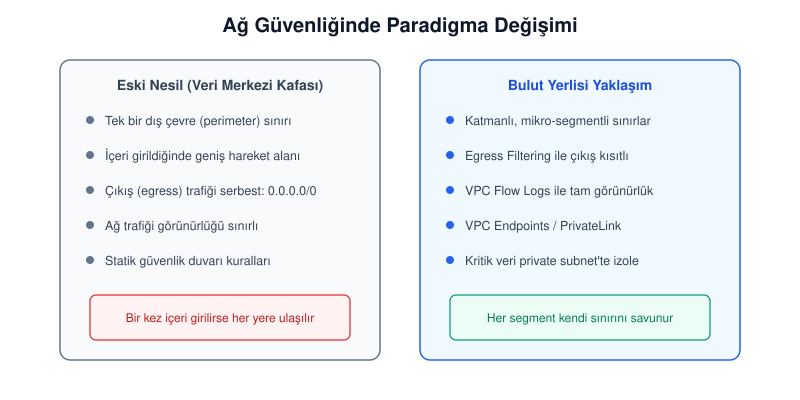

# Bulut Bilişim Güvenliği: Yapılandırma Hataları ve Kılavuz Notları

Bulut tarafına geçen kurumların çoğu aynı yanılgıya düşüyor: güvenliği bir "BT görevi" sayıp AWS, Azure ya da GCP'nin her şeyi kendiliğinden koruyacağını varsayıyorlar. Gerçek böyle işlemiyor. Bulutta olayların büyük kısmı sağlayıcının bir zafiyetinden değil, müşterinin bıraktığı küçük bir ayardan çıkıyor — açık kalmış bir depolama alanı, MFA'sız bir root hesap, tek bir kutucuğun işaretlenmemiş olması.

Bu yazı iki amaca birden hizmet etmeyi hedefliyor: konuya yeni başlayan biri baştan sona okuyup neden-sonuç ilişkisini kavrasın, tecrübeli biri de ihtiyaç anında hızlıca bakıp komutu veya kontrol maddesini bulsun. Aradaki köprü de basit: her teknik başlığın altında "bu neden önemli" sorusunun günlük hayattan bir karşılığı var.

---

## 1. Ortak Sorumluluk Modeli: Sınır Nerede Başlıyor, Nerede Bitiyor?

AWS'nin tanımladığı **Ortak Sorumluluk Modeli (Shared Responsibility Model)**, bulut güvenliğinin çatısını oluşturur ve iki ayrı sorumluluk hattına dayanır:

- **Bulutun Güvenliği (Security *of* the Cloud):** Fiziksel veri merkezleri, donanım ve sanallaştırma (hipervizör) katmanı — bunların güvenliği sağlayıcıya aittir.
- **Bulutun İçindeki Güvenlik (Security *in* the Cloud):** Veri, kimlik ve erişim yönetimi (IAM), ağ yapılandırması, şifreleme — bunlar müşteriye aittir ve kullanılan servise göre kapsamı değişir.

Bu ayrım kağıt üzerinde net görünse de pratikte kafa karıştırıyor. Sektör raporları, bugün yaşanan veri ihlallerinin önemli bir kısmının kökeninde yanlış yapılandırma, aşırı geniş yetkilendirme ve kimlik bilgilerinin kötü yönetimi olduğunu gösteriyor. Yani bulut güvenliği yalnızca teknik bir mesele değil; doğrudan finansal ve operasyonel sonuçları olan bir risk yönetimi konusu.

---

## 2. Bulut Kazaları: Küçük Ayarların Büyük Sonuçları

Bulutta en büyük hasarlar genelde karmaşık sıfırıncı gün açıklarından değil, unutulmuş küçük bir ayardan doğar. Aşağıdaki dört alan, teknik olmayan bir yöneticinin bile anlayabileceği ama gözden kaçtığında en çok can yakan noktalar.

### S3 Kovaları: Kapı Kilitli mi, Dolap Sokakta mı?

**Hata:** S3 (Simple Storage Service) gibi depolama alanlarının "Public" bırakılması.

Bunu günlük hayattan bir örnekle düşünmek en kolayı: bir S3 kovasını herkese açık bırakmak, şirketin hassas belgelerinin durduğu dolabı sokağa çıkarıp kilidini de açık bırakmakla aynı şey. İçinden geçen herkes durup bakabilir.

> **Not:** Hesap düzeyinde "Block Public Access" ayarını aktif edin. Bu ayar, bir mühendis yanlışlıkla da olsa bir kovayı herkese açık işaretlese bile bunu geçersiz kılan bir emniyet kilididir.

### Root Hesap ve MFA: Anahtarın Konumu

**Hata:** En yetkili hesap olan root'un çok faktörlü kimlik doğrulama (MFA) olmadan bırakılması.

MFA'sız bir root hesap, kapıyı kilitleyip anahtarı paspasın altına bırakmaya benzer — kilit var ama işlevsiz.

> **Not:** Root hesabını günlük işlerde kullanmayın, yalnızca hesap düzeyinde zorunlu işlemler için saklayın. Mümkünse donanım tabanlı MFA (örneğin bir güvenlik anahtarı) tercih edin.

### Aşırı Yetkili IAM: Her Kapıyı Açan Maymuncuk

**Hata:** Kullanıcılara veya servislere gereğinden geniş yetkiler — özellikle `AdministratorAccess` gibi — tanımlamak.

Bir stajyere yalnızca fotokopi odasının anahtarı gerekirken elinize binanın tamamını, kasayı ve sunucu odasını açan tek bir maymuncuk tutuşturmak gibi düşünün.

> **Not:** "Least Privilege" (en az yetki) ilkesini uygulayın: kullanıcıya ya da servise, işini yapması için gereken en dar kapsamlı yetkiyi tanımlayın; genişletme ihtiyacı doğduğunda ekleyin, baştan geniş vermeyin.

### İnternete Açık Güvenlik Grupları

Yönetim portlarının tüm internete (`0.0.0.0/0`) açık bırakılması, saldırganlar için doğrudan bir davetiyedir.

| Port | Servis | Risk | Modern Yaklaşım |
| :--- | :--- | :--- | :--- |
| 22 | SSH | Brute-force saldırıları | AWS Systems Manager Session Manager kullanın |
| 3389 | RDP | Uzaktan tam erişim riski | Yalnızca VPC Endpoints veya VPN IP'sine izin verin |
| 3306 / 5432 | MySQL / PostgreSQL | Yetkisiz veritabanı erişimi, brute-force ve servis istismarı | İnternete tamamen kapatın, yalnızca uygulama katmanına izin verin |

---

## 3. RDS Kontrol Listesi: Veritabanı Katmanının Referans Defteri

RDS (ilişkisel veritabanı servisi), verilerin kalesidir; ama bu kaleyi yanlış inşa etmek olayların en büyük kaynağıdır. Aşağıdaki liste, bir denetim sırasında elinizin altında bulunması gereken 15 maddelik pratik bir referans:

| # | Hata | Risk | Tespit | Çözüm |
| :-: | :--- | :--- | :--- | :--- |
| 1 | Kamuya açık RDS örneği | `PubliclyAccessible` bayrağı aktifse veritabanı internetten doğrudan brute-force'a açılır | `aws rds describe-db-instances --query "DBInstances[?PubliclyAccessible==\`true\`].{ID:DBInstanceIdentifier}"` | Bayrağı `false` yapın, RDS'i yalnızca private subnet'te barındırın |
| 2 | Kamuya açık snapshot | Snapshot "public" ise herhangi bir AWS hesabı veriyi kopyalayabilir | `aws rds describe-db-snapshots --snapshot-type manual --include-public` | Snapshot özniteliklerinden `all` değerini kaldırın |
| 3 | Encryption at rest kapalı | Disk üzerindeki veri şifresizse fiziksel/mantıksal sızıntıda doğrudan okunabilir | `aws rds describe-db-instances --query "DBInstances[?StorageEncrypted==\`false\`].{ID:DBInstanceIdentifier}"` | Yeni örneklerde şifrelemeyi baştan aktif edin (mevcut örnekler şifreli snapshot üzerinden taşınmalı) |
| 4 | AWS-managed anahtar kullanımı | Varsayılan `aws/rds` anahtarında rotasyon ve politika kontrolünüz kısıtlı | — | Customer-Managed Keys (CMK) ile anahtar yönetimini kendiniz üstlenin |
| 5 | SSL/TLS zorunlu değil | Veritabanı trafiği ağ üzerinde açık metin olarak izlenebilir | Parametre grubunda `rds.force_ssl` (PostgreSQL) veya `require_secure_transport` (MySQL) | Bu parametreleri `1` yaparak şifreli bağlantıyı zorunlu kılın |
| 6 | IAM veritabanı kimlik doğrulaması kapalı | Statik şifrelerin çalınma riski | — | `--enable-iam-database-authentication` ile geçici token tabanlı erişime geçin |
| 7 | Master parola Secrets Manager'da değil | Şifrenin kod içinde veya elle yönetilmesi | — | Parola yönetimini Secrets Manager'a devredin, otomatik rotasyonu açın |
| 8 | Yetersiz yedekleme süresi | Ransomware ya da yanlışlıkla silmede geri dönüş imkânı kalmaz | — | Retention period'u en az 7, ideali 14–30 gün yapın |
| 9 | Deletion protection kapalı | Tek bir `DeleteDBInstance` komutuyla veri tamamen silinebilir | — | `--deletion-protection` bayrağını aktif edin |
| 10 | `0.0.0.0/0` security group | Veritabanı portu tüm dünyaya açık | — | Yalnızca uygulama sunucusunun Security Group ID'sine izin verin |
| 11 | Log export kapalı | Olay anında adli analiz imkânsızlaşır | — | Audit, error ve slow-query loglarını CloudWatch Logs'a gönderin |
| 12 | Multi-AZ yok | Bölgesel kesintide tam veri kaybı ve iş durması yaşanır | — | Kritik veritabanlarında Multi-AZ kullanın; ayrıca cross-region yedekleme ve felaket kurtarma planı oluşturun |
| 13 | Auto minor version upgrade kapalı | Güvenlik yamaları alınmaz, bilinen CVE'lere açık kalınır | — | `--auto-minor-version-upgrade` özelliğini aktif edin |
| 14 | RDS internete açık subnette | Erişim kapalı olsa bile IGW rotası olan ağda bulunmak savunma derinliğini azaltır | — | RDS'i, Internet Gateway rotası olmayan izole subnet'lere taşıyın |
| 15 | Event notification yok | Failover veya saldırı girişiminden anında haberdar olunamaz | — | Kritik RDS olaylarını (security, failover, failure) SNS üzerinden uyarıya bağlayın |

---

## 4. IAM Yetki Yükseltme: Küçük Bir Yetkiden Tam Kontrole

IAM yetki yükseltme (privilege escalation), kısıtlı yetkilere sahip bir saldırganın "sıçrama tahtaları" kullanarak tam yönetici yetkisine ulaştığı zincirdir. Üç yaygın yol:

- **CreatePolicyVersion:** Kullanıcı sahip olduğu bir politikaya yeni bir versiyon ekleyip bunu `set-as-default` yaparak kendini fiilen sınırsız yetkili hâle getirebilir.
- **PassRole + RunInstances:** Saldırgan admin yetkili bir IAM rolünü yeni bir EC2 örneğine atar, o örneğe sızar ve örnek metadata servisinden admin token'ını çeker.
- **Lambda UpdateFunctionCode:** Mevcut bir Lambda fonksiyonunun kodu güncellenerek fonksiyona kendisine admin yetkisi veren bir kod parçası eklenir.

Üç yolun da ortak paydası aynı: gereğinden geniş yetki. Least Privilege ilkesi doğru uygulandığında bu üç kapı da kapanır.

> **KMS hata kalıpları:** KMS güvenliğinde "Pending Deletion Window" kritik bir kontrol noktasıdır. Bir KMS anahtarı silinmek üzere işaretlendiğinde AWS, yapılandırmaya bağlı olarak 7–30 günlük bir bekleme süresi uygular; anahtar kalıcı olarak silindiğinde ona bağımlı şifreli veriler kurtarılamaz hâle gelebilir. CloudTrail üzerinden KMS API çağrılarını izlemek de önemlidir — başarısız `kms:Decrypt` çağrıları tek başına saldırı kanıtı sayılmaz ama incelenmesi gereken bir sinyaldir. Kısacası: Key Policy dış kapı, IAM Policy iç kapıdır; içeri girebilmek için ikisinin de onayı gerekir.

---

## 5. Ağ Güvenliği: Bulutta Ağ Artık Yazılımdır

Geleneksel veri merkezi mantığındaki "tek bir dış sınır yeter" yaklaşımı bulutta işlemiyor. Bulutta ağ, statik bir duvar değil; kod ile tanımlanan, sürekli değişen bir yapı.

> **Not:** Veri sızdırma riskini azaltmak için çıkış (egress) trafiğini yalnızca gerekli hedeflerle sınırlandırın. İhtiyaca göre AWS Network Firewall, DNS Firewall veya VPC Endpoints/PrivateLink değerlendirilebilir. Kritik veritabanlarını private subnet'te tutmak saldırı yüzeyini doğrudan küçültür.

---

## 6. Sahada Neler Oluyor: 2026'dan İki Örnek

Teoriyi somutlaştırmak için iki farklı vakaya bakmak faydalı — biri Türkiye'den, biri güncel.

**Cosmolog Kozmetik vakası (Türkiye, 2021):** Yanlış yapılandırılmış bir S3 kovası nedeniyle, çeşitli e-ticaret platformlarında alışveriş yapan yaklaşık 567 bin kullanıcının ad-soyad, adres ve işlem detayı gibi bilgileri açığa çıktı. Ödeme bilgisi sızmasa da olay, "public bucket" hatasının soyut bir risk değil somut bir sonuç doğurduğunu gösteren yerli bir örnek olarak hâlâ öğretici.

**Framework–Metabase olayı (Ağustos 2026):** Dizüstü bilgisayar üreticisi Framework, kullandığı iş analitiği sağlayıcısı Metabase'in bulut altyapısındaki bir güvenlik açığı üzerinden tüm müşterilerini etkileyen bir veri güvenliği olayı yaşadığını duyurdu. Metabase, saldırının daha önce bilinmeyen bir açık (sıfır gün) üzerinden gerçekleştiğini ve saldırganların bu yolla bulut sunucularındaki müşteri veri tabanına eriştiğini açıkladı. Bu vaka, doğrudan bir yapılandırma hatası olmasa da önemli bir noktayı hatırlatıyor: kendi ortamınızı ne kadar sıkı yapılandırırsanız yapılandırın, kullandığınız üçüncü taraf bulut servisleri de saldırı yüzeyinizin bir parçası. Tedarik zinciri güvenliği bu yüzden artık ayrı bir başlık değil, bulut güvenliğinin doğal bir uzantısı.

**KVKK açısından pratik not:** Türkiye'de kişisel veri işleyen kuruluşlar için bir bulut yapılandırma hatası aynı zamanda bir KVKK meselesidir. İhlal tespit edildiğinde makul bir mazeret olmaksızın 72 saat içinde Kişisel Verilerin Korunması Kurumu'na bildirim yapılması gerekir; bu süre ihlalin fark edildiği andan itibaren işler. Denetim ve otomasyon yatırımını yalnızca teknik risk değil, yasal süre baskısını azaltan bir önlem olarak da düşünmek gerekir.

---

## 7. Remediation ve Otomasyon: Güvenlik Bir Proje Değil, Bir Döngü

Bu kadar çok kontrol noktasını elle takip etmek sürdürülebilir değil. Olgunluk aşamaları şöyle ilerliyor:

1. **Görünürlük:** Tüm kaynakların CSPM ile anlık envanterinin çıkarılması.
2. **Statik tarama (shift-left):** Kodun canlıya çıkmadan IaC tarayıcılarından geçmesi.
3. **Graph tabanlı analiz:** Varlıklar arası ilişkileri inceleyerek gizli saldırı yollarının bulunması.
4. **Otomatik düzeltme:** Hatalı bir ayar algılandığında sistemin bunu kendiliğinden geri çevirmesi.

| Araç | Odak | Faydası |
| :--- | :--- | :--- |
| Checkov / tfsec | IaC (Terraform, Kubernetes) | Kod yazılırken `0.0.0.0/0` gibi riskli kuralları daha canlıya çıkmadan engeller |
| AWS Security Hub | Uyumluluk denetimi | CIS Benchmark uyumunu anlık raporlar |
| Wiz / Cloudanix | CSPM / graph analizi | Saldırı yollarını görselleştirir, riskleri önceliklendirir |

---

## Kapanış

Bulut güvenliği tek seferlik bir kontrol listesi değil; sürekli denetim, otomasyon ve iyileştirmeden oluşan bir döngü. Altyapıyı kodla yönetmek (IaC), güvenliği bu kodun içine baştan gömmek ve manuel hataları sistemin kendisiyle engellemek — bu yazıdaki tüm maddeler aslında tek bir cümleye çıkıyor: en pahalı güvenlik açığı, çoğu zaman en basit olanıdır.

